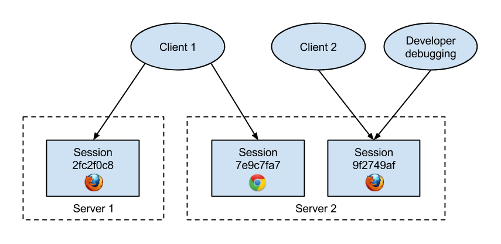

Selenate
========
Selenate is a cloud-based web-scraping framework build on top of *[Selenium WebDriver](http://www.seleniumhq.org/projects/webdriver/)*, which aims to simplify complex scraping jobs, and extend basic *Selenium* functionality.

Arhitecture
-----------
Selenate is based on Client-Server arhitecture. Server hosts scraping sessions and runs the browsers while clients connect to the sessions and issue commands.

In this example, we have three clients and two servers: `Client 1` has two active sessions: one on `Server 1`, and the other on `Server 2`, while `Client 2` and `Developer` are both connected to session `9f2749af`.

Features
--------
List of *Selenate's* main features:

##### Session management #####
Each scraping process has a session associated with it. Sessions can be saved and resumed, and they can be shared between clients.

##### Retryable actions #####
To account for the fact that sometimes actions fail because of mysterious reasons, Selenate has support for automatic action retrying (until the action succeeds, for a maximum of a specified number of retries).

##### Frame and window management #####
Client code doesn't need to worry about switching between frames and windows, Selenate can manage them automatically.

##### Keepalive #####
For sessions that require constant activity to remain active (auto log-out), Selenate can automatically and periodically execute a specified set of commands, to prevent session from expiring.

##### Browser pool #####
Selenate supports a browser pre-loading for faster session initialization.

##### Session recording #####
Selenate can record a video of the entire scraping session for debugging purposes.

##### Robot and Sikuli support #####
Selenate has a support for native mouse and keyboard actions, as well as [Sikuli](http://www.sikuli.org/) integration.

##### Java Applet support #####
Selenate supports working with Java applets embedded in web pages.
